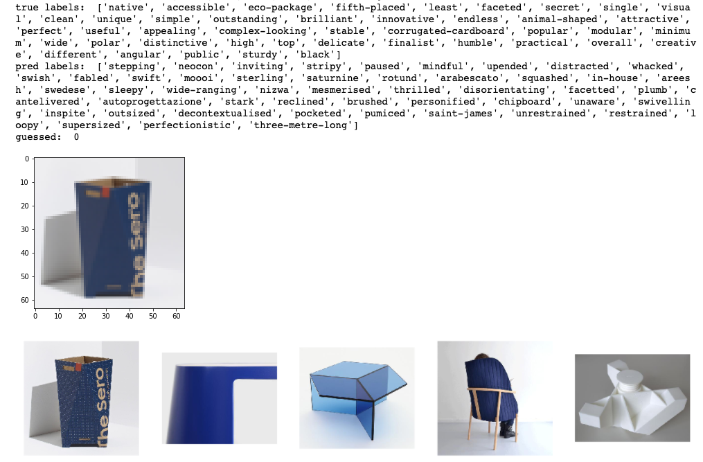
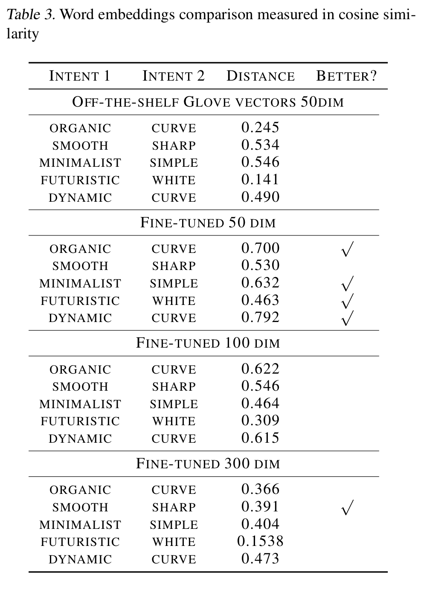
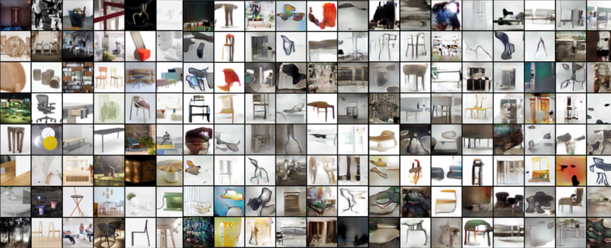

# Multimodal Machine Learning: Cross-modal retrieval on ADARI dataset

Repo for the course 11-777 Multimodal Machine Learning, at Carnegie Mellon University. 

## Abstract
Language is ambiguous; many terms and expressions convey the same idea. This is especially true in design fields, where conceptual ideas are generally described by high-level, qualitative attributes, called design intents. Words such as organic, sequences like the chair is a mixture between Japanese aesthetics and Scandinavian design or complex structures such as we made the furniture layering materials like “a bird weaving its nest” represent design intents. Furthermore, most design intents do not have unique visual representations, and are highly entangled within the design artifact, leading to complex relationships between language and images. Despite advances in machine learning (ML) in vision-and-language representations, state-of-the-art ML models are unable to efficiently disentangle such relationships and consequently, incapable of modeling their joint distribution. Beyond ML research, this work can significantly impact creative practice for designers, architects or engineers. A real-time understanding of design intents could open new design scenarios (e.g. voice-assisted natural language input), that reduce procedures based on intent reinterpretation as imperative commands —move, circle, radius, extrude, vertical— required by digital design engines. ML provides an alternative to such current design frameworks: the means to learn meaningful representations of ambiguous descriptions, like dynamic, light or minimalist. As such, we propose a first-of-its-kind multimodal object-agnostic framework to disentangle, visualize and generate design intents to support a transition from CAD—Computer-Aided Design— to AIAD—Artificial Intelligence-Aided Design.

Our project gravitates around the Ambiguos Descriptionsand Art Images—ADARI—dataset. This dataset is a novel collection of images and descriptions with special emphasis on qualitative attributes present in design intents. The novelty of this project comes, therefore, from the study of such subjective qualitative attributes, and currently, we are testing whether state-of-the-art multimodal approaches on retrieval, captioning or generation work on ADARI. We prove that such current models, objective functions and evaluation metrics are not efficient when dealing with intents, and that weare initiating an exploratory process to determine which task we will focus on for the remainder of the project. 

## Introduction
Language can be ambiguous and similar ideas can be expressed in many different expressions. This is specially true in design fields, where conceptual ideas are generally described by high-level, qualitative attributes, called design intents. Even though these descriptors are highly used in everyday language by designers—"the dinning table should look more organic", "this chair is lightweight and minimal"—, they have complex visual associations due to a partial subjective and conceptual components and thus, finding visual representations is a challenge. While humans might be able to identify design intents from an image of a chair with attributes such as organic or minimalist, and differentiate between a heavyweight and a lightweight stand-lamp, they might also face challenges differentiating design intents such as dynamic, organic or functional. Current machine learning literature is unable to recognize this type of high-level attributes, but has potential to understand them. Resolving such task would have a major impact in design communities, opening new scenarios where natural human language could directly be used in the process of design. 

   
  
  
 Figure 1. Complex relationships between modalities in a sample from ADARI Furniture dataset 

For computational linguistics, resolving this problem can challenge the status of theoretical understanding, problem-solving methods and evaluation techniques [8]. For computer vision, this presents a complex challenge of disentangling qualitative attributes—sleek, elegant, minimal—from images. Beyond its relevance in pushing machine learning research boundaries, this would significantly impact creative practice —designers, architects and engineers. Real-time design intents understanding could open new design scenarios (e.g. voice-assisted natural language input), that reduce procedures based on intent reinterpretation as imperative commands —move, circle, radius, extrude, vertical— required by digital design engines. 

### ADARI Dataset 
To address the issue of disentangling design intents in thecontext of creative practice, we use the Ambiguous Descriptions and Art Images—ADARI—dataset. The self-annotated ADARI dataset contains a total of 33,230 samples of contemporary creative works represented by 264,028 raw sentences provided by the original creators and by art curators that describe 241,982 images.  This dataset was assembled by collecting articles that include editorial descriptions along with associated images of the creative visual work.  ADARI is an organized dataset divided into seven categories: architecture, art, design, fashion, furniture, product design and technology. ADARI is the first dataset of pairs of images and descriptions that, besides containing objective information of the elements in the images such as wooden chair or black table, focuses on descriptions that correspond to design intents, such as minimal, elegant and sleek looking chair. Table 1 shows the raw counts of samples, images per domain, and sentences and adjectives from creators and curators per domain. Table 2 shows that given a visual workpiece, original creators use a more ambiguous language than curators in their descriptions, that it, normalized results of a human classification of ADARI labels into qualitative or quantitative attributes.  Over 500 adjectives per source (cretaor, curators and both) and per domain (furniture, fashion, wearable technology) have been annotated. Unsurprisingly, creators express their design intents while curators tend to describe the work objectively. Both sources of language are used as annotations for the labels of thedataset.

   
  
  
 Figure 1.ADARI dataset. Rows: architecture (top), furniture (mid-dle), fashion (bottom) sub-domains in ADARI. Columns, from left to right: images with label <em>interesting, simple, organic, different,iconic, minimalist.</em> 

To simplify the complexity of the ADARI datset, and unlessotherwise stated, we use the ADARI Furniture domain inall  experiments.   This  contains  over  17,000  images  andapproximately a total of 60,000 adjectives.

   
  

### Research Challenges
Creative practice is a broad term that encompasses those fields that produce creative work. Specifically, in the contextof this project,  we refer as creative practice to any fieldthat relies on visual mediums and feedback in the creative process.  This includes works by designers, architects or engineers. In these domains, expressive language, used todescribe, review and discuss work, is crucial.  This type of language gravitates around design intents. For example,image a designer says to a colleague that they shoulddesignthe chair with a more dynamic look; the word <em>dynamic</em> conveys the design intent,  but it can be embodied in an intractable number of visual forms and design variations. While  design  intents  also  include  quantitative  attributes, such as colors, materials or dimensions, a great part of thevocabulary corresponds to qualitative traits.

The main technical challenge of this project is to disentanglesuch attributes from the design objects. For this, tasks suchas classification, retrieval or generation might require different objective functions and evaluation metrics. An important part of this project is to test such different techniques andcurrent models on ADARI, and gauge their effectiveness in disentangling intents.

   
  

## Prior Work
This section first reviews general previous work that provide some context and frame this project.  We then explain in detail some prior work that we have implemented and tested on the ADARI dataset. Lastly, we discuss prior work done using the ADARI dataset.

### General Review and Project Context
Powerful representation ability of multimodal approaches with multiple levels of attraction has proven successful in applications on event detection [9, 10], cross-modal retrieval [1, 11–13], cross-modal embeddings [4, 14–16] and image caption [6, 17]. Generative neural models have gained interest and exponential adoption by creative researchers. In addition to offering image generation of unseen but realistic images [18], image painting [19, 20] or image manipulation [21–25]. 

Most recently, generative adversarial learning has extended to multimodal cases, including text-to-image synthesis [26, 27], handwritten text generation [28], and visual captioning [29-31]. This work, directly and indirectly, enable more intelligent and intuitive interfaces for designers: by advancing techniques for object selection, image reconstruction or real time video object removal, used in commercial design software.

While current state-of-the-art image captioning is able to describe an image of <em>“a girl wearing a red shirt”</em>, likewise, current retrieval models are able to retrieve pictures of red shirts. However, neither image captioning systems, retrieval models or generative models are able to describe, retrieve or generate an image of <em>“a sleek, elegant and minimal looking chair”</em>. Our current research project navigates these mediums, aiming to recognize the patterns of human intents that design objects register in the image space. Related to such subjective patterns, Neuberger et al., explore the means to learn subjective fashion traits [32].

### Cross-modal Retrieval Methods
#### Coordinated Representation Baseline: Two Way Nets
ADARI raises a key question about design: How can we unify the intent of the designer with the design itself? Such question immediately leads to coordinated representation learning. This task aims to embed images and the corresponding text in the same subspace. Published in 2017 by Eisenschtat et. al, the Two Way Net architecture uses two tied autoencoders to first encode each view into an embedding, and then transform each view into the opposite one. The authors introduced some novelties, including regularizing the batch normalization layers and tying the masks of dropout layers between paired autoencoders. 

The Two Way Net architecture requires the inputs to be pre-encoded by some unimodal method, ideally one that extracts relevant features for the multimodal case. To evaluate this model, we employed the ResNet embeddings of the images. For the adjectives used to describe each design, we use GloVe embeddings of each word and concatenated them together (as was done in the original Two Way Net paper). We used 3 hidden layers per autoencoder, of sizes 2000, 3000, 16000, with the second layer output used as the hidden embedding (as was done with the Flickr30k experiments). The model was trained from scratch with ADARI, using similar hyperparameter settings to those used for the Flickr30k experiments done by the original authors. The model's loss did converge after 100 epochs, as recommended by the authors of the original paper. As a baseline, we aimed to simply see if Two Way Nets with ResNet and GloVe embeddings were capable of clustering around design intent across modalities. As a simple qualitative test, we used t-SNE to reduce the hidden embeddings of the test set to two dimensions, and plotted the result. We ran t-SNE for all perplexities between 5 and 50, achieving best performance at perplexity 36. 

This clustering suggests the Two Way Nets were able to encode similarities in the unimodal representations, however. A closer inspection of these clusters using simple nearest neighbours shows some relationships like the figures 3 and 4. These chairs share design elements, including both their material and simplicity.

   
  
     

  
 Figure 2. Image Nearest Neighbor 

For a quantitative measure of the clustering of our hidden coordinated representations, we performed numerous clustering techniques, including kmeans, affinity propagation, agglomerative clustering, OPTICS, and Birch. However, each method produced only two clusters, each containing one of the modalities. It is thus evident that vanilla Two Way Nets using our configurations are not capable of capturing understanding of design intents. While our analysis is not exhaustive, this result is to be expected given the complexities of design intents. It is highly unlikely out of the box image embedding techniques will not capture features relevant for analysing design intents, as these models are often trained for object detection tasks. This shows the gap between tasks that ADARI presents and classic image captioning/object detection techniques. 

   
  
  
 Figure 3. Two Way Net-generated embeddings reduced to dimension 2. Green samples are embeddings of images, blue are embeddings of text. 

#### Joint Representation Baselines
We have explored three related papers that provided state-of-the-art results on image and sentence retrieval using joint representations at the time of publishing: <em>Unifying Visual-Semantic Embeddings with Multimodal Neural Language Models</em> by R. Kiros et al., <em>DeViSE: A Deep Visual-Semantic Embedding Model</em> by A. Frome et al., and <em>Multimodal Convolutional Neural Networks for Matching Image and Sentence</em> by L. Ma et al. They all base their learning using different types of contrastive loss. 

Ma et al. propose a model based on three convolutional networks coupled end-to-end, one for learning image representations, called image CNN, another one to produce the joint representation of an encoded image representation and word representations, called matching CNN, and an MLP that takes the joint representation and outputs the matching score between image and words, see Figure 4. The image CNN is a pre-trained CNN network (the authors use VGG with 19 weight layers, and the OverFeat network). The core network is the matching CNN, and the authors design different networks that work at different language-level matching relations, such as word-level, phrase-level or sentence-level. Their loss function is defined as eq. \ref{eq1}, where \(s_{match}\) is the output of a the MLP (using a relu nonlinearity). They test their models on Flickr8K, Flickr30K and Microsoft COCO datasets. For evaluation, they report the median rank, and the R@K (with K=1,5,10), which computes the fraction of times the correct result was found among the top K items. 

<em>(1)</em>

DeViSE and Unifying visual-semantic embeddings approaches use the same loss function as in eq.2, and instead of using another neural network for calculating the matching score, they use the last layer's weights of a pre-trained CNN, such as VGG and others. DeViSE tests their results on ImageNet (ILSVRC) 2012 1K dataset while that Kiros et al. use Flickr8K and Flickr30K. The main different between the two is that DeViSE use pre-trained Glove vectors directly, and for sentences they average the word emeddings while that Kiros et al. use an LSTM to get the representation of the sentence. 

<em>(2)</em>

We have implemented the three papers, and while we are still running experiments, and therefore, we do not have evaluation metrics yet. We use the same hyperparameters as the original papers, reducing the batch size to 64 due to memory issues. The inputs to the network are variable size list of single words, capping the limit to words max. Different from the original papers, we use a pretrained ResNet-152 as image embeddings, and set the image embedding size matching the word embedding size, that is, 50 dimensions. As loss functions, besides using eq. 1 and 2, we use cosine similarity between the two embeddings. These models converge quick, in less than 10 epochs, and the initial experiments are not being successful. More work is to be done to show the real capacity of these models on ADARI.  

   
  
  
Figure 4. The m-CNN architecture for matching image and sentence. Image representation is generated by the image CNN. Matching CNN composes words to different fragments of the sentence and learns the joint representation of image and sentence fragments. MLP summarizes the joint representation and outputs the matching score. 

(update). I've adapted triplet loss to the mCNN framework, and as expected, it doesn't work for the ADARI datset. It seems to group images based on similar features, but the associated language is meaningless. 

   
  
  
Figure 5. Test sample of the m-CNN architecture for matching image and sentence using triplet loss. 

#### Prior Work on ADARI
Preliminary explorations that visually disambiguate vague terms in the context of design have been done by [7]. The authors use a multimodal approach that combines a pretrained convolutional neural network, ResNet-152, to get the representation for images with general word indexes into a common joint subspace. A bidirectional Long Short-Term Memory (biLSTM) decoder—which models the labels co-occurrence information—learns semantic relationships between words and images. Early results are positive and encouraging for several reasons: the baseline presented is able to detect design nuances in the images that relate to ambiguous words such as “curvaceous”, “wobbly”, “linear”, or “slouchy”, where none of the corresponding images necessarily had those labels applied in the ground truth (see Figure 6). This is an indication of a potential approach for understanding ambiguous terms through associations of words-images. 

   
  
  
Figure 6. Visual language semantic relations. 

## Unimodal Explorations
### Finetune Glove Vectors
To evaluate unimodal representations of in-domain (design) language, we compared three results: training embeddings from scratch, with random initialization of weights, using pre-trained Glove vectors, and fine-tuning Glove vectors following a skipgram model. For that, we initiate the weights of the skipgram model with the glove vectors, and run the model for 20 epochs on ADARI. We found that fine-tuning Glove embeddings yielded better results.  

The vocabulary focuses on 3400 adjectives extracted from both sources, creators and curators in ADARI, capturing both qualitative and quantitative adjectives, plus the existing vocabulary in Glove. If a particular word from ADARI does not exist on the Glove vocabulary, we initiate the weights with a normal distribution with scale of 0.6. We frame the context of the words with a window-size of five on each side of the word, and we tested 50, 100, 200 and 300 dimensional embeddings. The 50 dimensional embeddings yielded better results, evaluated through manual inspection by design experts, see table 1.

   
  

### DCGAN on ADARI
We ran a DCGAN model on ADARI, using the same parameters as the original paper, to evaluate whether the ADARI dataset provides the means for deep learning models to learn the image distribution. We do not have evaluation metrics yet of this experiment, although the results generated by the network are positive, see Figure \ref{gan}. The fact that ADARI seems consistent across its subdomains, like furniture, is an indicative that we could further use some type of conditional GANs to generate visualizations of design intents. It is important to clarify that we are not looking to generate new design outputs within a subdomain, like a chair, or a table. Rather, we would be interested in creating a model that is able to learn the distributions responsible for shaping design intents, that is, would it be possible to generate images that directly forge the visual attributes corresponding to intents such as dynamic, smooth or minimalist?

   
  
  
Figure 7. Results of DCGAN trained on ADARI. The first six columns are real images. 

