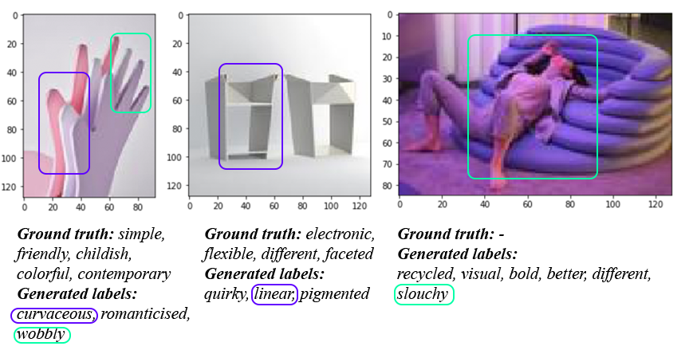
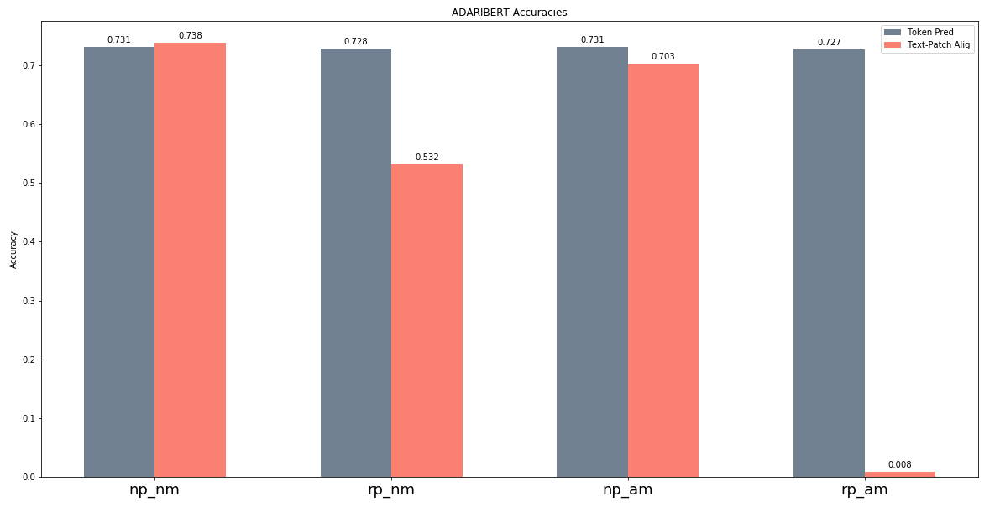
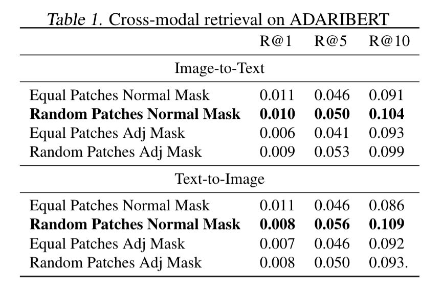
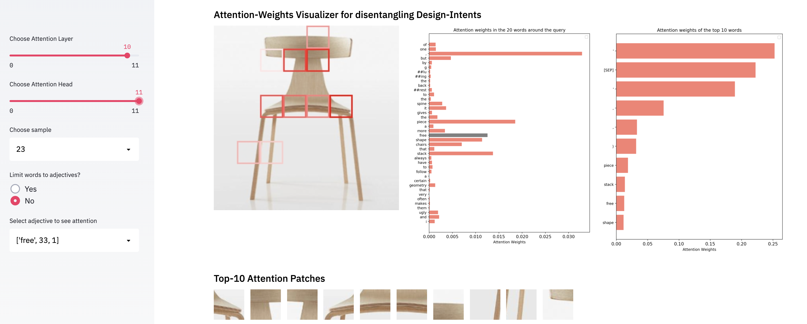
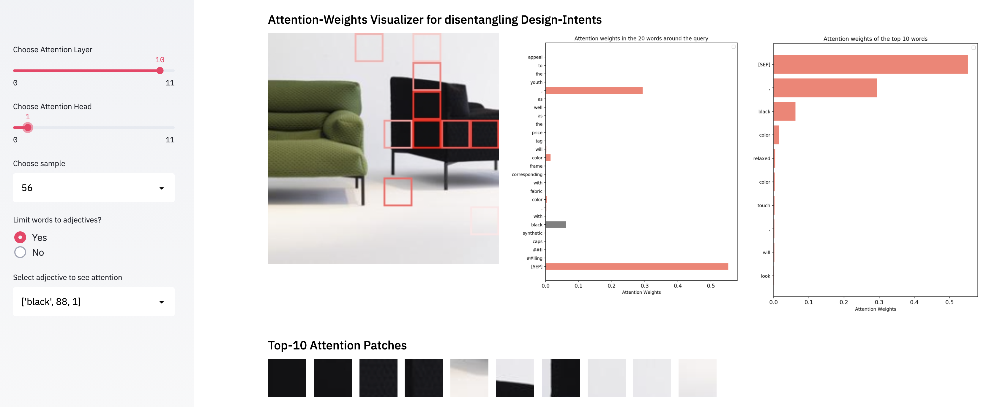
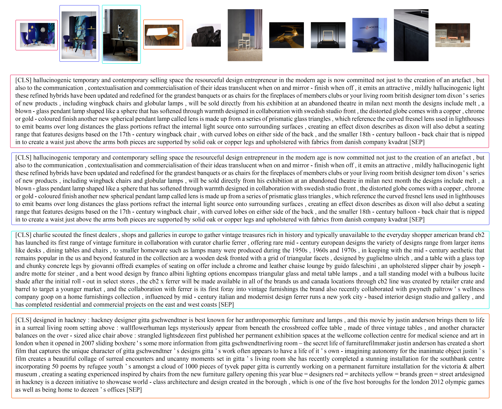

# Multimodal Machine Learning: Disentangling Design Intents 

Repo for the course 11-777 Multimodal Machine Learning, at Carnegie Mellon University. 

## Abstract
Language is ambiguous; many terms and expressions convey the same idea. This is specially true in creative practice, where design intents —high-level descriptions— correspond to conceptual ideas in the process of design. Words such as \textit{organic} or structures such as *we made the furniture layering materials like "a bird weaving its nest"* are design intents. These are highly entangled within objects in images, and are more complex to detect than objects and stylistic attributes. Furthermore, we work with unstructured natural conversations about design objects, which normally include rejections, negations and contextual information about the designer's philosophy that can be vaguely applied to the objects we see in images. Current machine learning models are unable to disentangle such complex relationships. In an attempt to break this ground, we explore this problem working on the ADARI—Ambiguous Design and Artistic Images— dataset. Building off of the FashionBERT architecture, we propose ADARIBERT, a framework for disentangling design intents. We examine a number of directions in an effort to ground design descriptions in design images. We formulate this grounding in several tasks including image-description alignment and cross-modal retrieval. 

## Introduction
Language can be ambiguous and similar ideas can be expressed in many different expressions. This is specially true in design fields, where conceptual ideas are generally described by high-level, qualitative attributes, called design intents. Even though these descriptors are highly used in everyday language by designers—"the dinning table should look more organic", "this chair is lightweight and minimal"—, they have complex visual associations due to a partial subjective and conceptual components and thus, finding visual representations is a challenge. While humans might be able to identify design intents from an image of a chair with attributes such as organic or minimalist, and differentiate between a heavyweight and a lightweight stand-lamp, they might also face challenges differentiating design intents such as dynamic, organic or functional. Current machine learning literature is unable to recognize this type of high-level attributes, but has potential to understand them. Resolving such task would have a major impact in design communities, opening new scenarios where natural human language could directly be used in the process of design. 

For computational linguistics, resolving this problem can challenge the status of theoretical understanding, problem-solving methods and evaluation techniques [8]. For computer vision, this presents a complex challenge of disentangling qualitative attributes—sleek, elegant, minimal—from images. Beyond its relevance in pushing machine learning research boundaries, this would significantly impact creative practice —designers, architects and engineers. Real-time design intents understanding could open new design scenarios (e.g. voice-assisted natural language input), that reduce procedures based on intent reinterpretation as imperative commands —move, circle, radius, extrude, vertical— required by digital design engines. 

Research on identifying high-level attributes has been done in other tasks. For instance, for selecting font types using attributes by \cite{odonovan:2014:font}, or for search tasks on fashion objects with relative attribute feedback by \cite{whittlesearch}. Even this work is very related to our work, they focus on other searching strategies and not necessarily cross-modal retrieval, and their attributes are generally based on single adjectives.

One of our main challenges that has not been addressed is working with unstructured text. Our ADARI dataset does not contain only valid descriptions applied to each image. Rather, it is a report type document from interviews between designers and reporters. As seen in Figure \ref{datasample}\footnote{All images subjected to copyright. Used here for research purpose. Image: The metamorphosis, by Tadeas Podracky}, each data sample consists of a text document and multiple images that correspond to the same text document. 

In this work we aim to ground such relationships between modalities. The failure of some multimodal baselines we have explored, i.e. Two Way Nets \cite{eisenschtat2017linking}, indicate that more complex relationships must be modeled. This motivates attention-based models like BERT \cite{devlin2018bert} and its multimodal derivatives, which use attention mechanisms to relate objects both within modalities and across modalities. We expand upon FashionBert \cite{gao2020fashionbert}, a framework that tackles a similar problem of disentangling design elements. The fashion descriptions from their data, however, are purely focused on the designs themselves, and most descriptions are objective rather than conceptual. In addition, we modify their image encoding strategy in an effort to make our model completely agnostic to the object itself. Finally, we adopt a modified token masking scheme to place more weight on masking adjective tokens because most keywords in design intents, such as \textit{minimal}, or \textit{organic}, are adjectives, and we hypothesize that these should provide a better training signal with respect to using the visual modality to infer language. 

### Related Work
This section first reviews related work in the area of design and high-level attributes, then we review current SOTA multimodal transformer models. Lastly, we discuss prior work done using the ADARI dataset. 

### High-level attributes
Research in understanding the relationships between high-level attributes and objects has not received much attention in comparison with work in object-quantitative attributes. Some previous work have focused on image composition, particularly on high-level attributes of beauty, interest and memorability. 

Previous authors described methods to predict aesthetic quality of photographs. \cite{aesthetics} represent concepts such as colorfulness, saturation or rule-of-thirds with designed visual features, and evaluated aesthetic rating predictions on photographs.\cite{li2009aesthetic} used the same approach for impressionist paintings. \cite{dhar2011high} expand the feature space with more high-level descriptive features such as "presence of animals" and "opposing colors", and also attempted to predict Flickr's proprietary "interestingness" measure. Following this type of work, \cite{gygli2013interestingness} predicted human evaluation of image interestingness, building on work by \cite{isola2011makes}, who uses various high-level features to predict human judgements of image memorability. Similarly, \cite{borth2013large} performed sentiment analysis on images using object classifiers trained on adjective-noun pairs. Building on all these works, \cite{karayev2013recognizing} present two novel datasets: 80K Flickr photographs annotated with 20 curated style labels, and 85K paintings annotated with 25 style/genre labels, and provide a baseline for style prediction, with examples of such styles being "Impressionism", "Abstract Expressionism", "Romantic" or "Minimal". 

Continuing on style type problems, more recently \cite{gatys2016image} present a system that creates artistic images based on style and content images. A seminal paper was published by \cite{isola2017image} where conditional adversarial networks \cite{mirza2014conditional} are used for image-to-image translation tasks. 

Research that focus on attributes rather than style have also been explored. \cite{odonovan:2014:font} explore new ways to make interfaces for font selection more natural, organizing fonts based on high-level descriptive attributes such as "dramatic", "legible" or "friendly". Most recently \cite{wang2020attribute2font} proposed a novel model called Attribute2Font to automatically synthesizing visually pleasing glyph images according to user-specified attributes and their corresponding values. The claim to be the first model in the literature capable of generating glyph images instead of retrieving existing fonts. Their model performs font style transfer between any two fonts conditioned on their attribute value.

Object attributes have been explored for image search using binary attributes in works by \cite{kumar2011describable, tao2009skyfinder}. Other work for searching interfaces has been done by \cite{parikh2011relative}, estimating relative attributes. Whittlesearch \cite{whittlesearch} allows searching image collections using also relative attributes. In the following year \cite{kovashka2013attribute} improved their technique by using an adaptive model. Two people may have slightly different internal models for what makes a shoe look "formal", or they may disagree on which of the two scenes looks "more cluttered". Rather than discount these differences as noise, they propose to learn user-specific attribute models by adapting a generic model trained with annotations from multiple users. 

#### Multimodal Transformers
Since \cite{vaswani2017attention} released the seminal paper 'Attention Is All You Need', much of the work in language and vision-and-language shifted towards the use of the Transformer architecture. Namely, \cite{devlin2018bert} released BERT, a bidirectional encoder representation from transformer model which abandons the idea of recurrent neural networks to focus mainly on attention mechanisms to capture contextual information in long text sequences. Since then, BERT has been adapted to many other multimodal fields, mainly in vision-and-language tasks. For instance, ViLBERT \cite{lu2019vilbert} and LXMERT \cite{tan2019lxmert} apply a transformer architecture to each of the language and vision modalities, to later combine them with a cross-modal transformer. 

Other work such as VisualBERT \cite{li2019visualbert}, Unicoder-VL \cite{li2020unicoder}, VL-BERT \cite{su2019vl}, UNITER \cite{chen2019uniter} or ImageBERT \cite{qi2020imagebert} concatenate image and sentence into a single sequence before feeding it into the transformer model. Generally, these models leverage semantic information at the object level, and split the images into regions of interests that normally capture the entire object, and correspond to the outputs of object detection architectures such as faster R-CNN \cite{ren2016faster}. Most recently, \cite{gao2020fashionbert} uses a multimodal transformer to perform cross-modal retrieval on attribute-level region of interests for text and image matching. 

This last work is most related to our research, and we extend it to ADARI. The FashionBERT model makes a few contributions to the multimodal BERT architecture, including splitting the images into 8x8 patches. Such patching, as opposed to using region of interests, partially destroys the underlying object in an attempt to make the attention mechanism focus on local features to ground fashion-related stylistic elements. 

#### Prior Work on the ADARI dataset
Preliminary explorations that visually disambiguate vague terms in the context of design have been done by \cite{Ladrondeguevara2020multimodal}. The authors use a multimodal approach that combines a pretrained convolutional neural network, ResNet-152 \cite{resnet}, to get the representation for images with general word indexes into a common joint subspace. A bidirectional Long Short-Term Memory (biLSTM) decoder—which models the labels co-occurrence information—learns semantic relationships between words and images. Early results are positive and encouraging for several reasons: the baseline presented is able to detect design nuances in the images that relate to ambiguous words such as “curvaceous”, “wobbly”, “linear”, or “slouchy”, where none of the corresponding images necessarily had those labels applied in the ground truth (see Figure \ref{pred}). This is an indication of a potential approach for understanding ambiguous terms through associations of words-images. 

   
  
  
Figure 2. Visual language semantic relations. 

To our knowledge, our work is the first attempt to scale work on high-level attributes on very complex unsupervised scenarios, where images do not have ground truth associating descriptors. Furthermore, our language modality does not come from third party workers annotating the data, but the very own natural description from professional designers, which is the most important aspect. Since the goal of this project is to be able to integrate this knowledge and comprehend designs more naturally, we need the language to be as consequent and honest with the design as possible, rather than just a third person's opinion on the work. 

### Proposed Approach 
In this section we succinctly explain how the BERT language model works, then we describe how we extract image features and how we build our multimodal version of BERT. Finally we explain how our model learns to disentangle design intents. 

   
  
  
 Figure 3. Our ADARIBERT framework 

#### BERT
The BERT model was introduced by \cite{devlin2018bert}, and uses the transformer architecture \cite{vaswani2017attention} with a word-piece \cite{wu2016wordpiece} approach that divides words into tokens to be fed into the model. Every subword is projected into a set of embeddings $E$, and each embedding $e\in E$ is computed as a sum of token embedding particular to each subword, segment embedding which indicates the part of the text that comes from, and position embedding that encodes the position of the token. This is fed into the multilayer BERT transformer, which generally has 12 or 24 layers, and outputs contextualized representations of each token. 

BERT is generally trained in two steps, pre-training and fine-tuning, where the former step is done using a combination of two objectives, mask language modeling and next sentence prediction. The latter step generally applies BERT to a particular task using different objectives according to the training task. We use the publicly available transformer library by HuggingFace \cite{wolf-etal-2020-transformers}, as a backbone for our implementation in PyTorch

#### ADARIBERT
Our approach is to use the self-attention mechanisms of the BERT model to address two main tasks: 
- Ground high-level attributes in images in an object-agnostic approach. 
- Use within-language attention mechanisms as means to find relevant parts of our unstructured text and filter out those sentences that do not relate to the images, such as contextual information. 

In addition to the the text components in BERT, we introduce a set of visual tokens to model an image and learn joint representations of design intents and design images. The ADARIBERT model is illustrated in figure \ref{adaribert_model}.([^1])

Generally, vision-and-language BERT models like VisualBert \cite{li2019visualbert} or VilBert \cite{lu2019vilbert}, use object-detection methods to extract objects within the image, and pass the entire isolated objects through the multimodal transfomer. Our research differs from such method in a fundamental way: building an object-agnostic model that disentangles design intents. For this approach, we propose two strategies to process the images. Following the FashionBert model, we resize images to 64x64 pixels and break them into 64 patches of 8x8 pixels each. We pass this sequence of patches along with a position embedding which theoretically gives the model the option to reconstruct the entire image. We called this strategy equal—or normal— patching (NP). With the intention of destroying the object representation completely, our second approach takes a step further and produces random patches of positions and sizes, with a minimum of 4 and a maximum of 16 pixels in width and height. In this case, since the patches are randomly generated, there is no explicit order, and therefore, we do not use any position embeddings. We called this approach random patches (RP) —see Figure \ref{normalvsrandom}. The model is then tasked with grounding these patches with the design intent in the original description.

([^1]:All images subjected to copyright. Used here for research purpose. Image: Dumbo, by Studio Pesi)

#### Training ADARIBERT
Our training schema for ADARIBERT consists of three main objectives:
- Masked Language Modeling (MLM): This is a regular BERT training task in which text tokens, encoded using the wordpiece strategy, are masked with a probability of $15\%$ and the model must minimize the negative log likelihood of predicting the original mask token, using surrounding language tokens and vision patch tokens. Given a sequence of text tokens $t_i = {t_1, t_2, ..., t_N}$ the masked-out sequence is denoted by $t_{\backslash i} = {t_1, t_{MASK}, ..., t_N}$. The last-layer of the transformer model output is fed into a linear classifier with vocabulary size the standard BERT model. The objective is defined as follows: $$l_{MLM}(\theta) = - E_{t \sim D} \log P(t_i|t_{/i}, \theta)$$ where $\theta$ corresponds to the ADARIBERT parameters, $D$ is the training set and $P(t_i|t_{/i})$ is the probability of the masked-out token $t_i$ predicted by the model given the rest of the language and vision tokens. 

We propose a variant of the MLM approach that focuses on masking those words that their part of speech tag corresponds to adjectives with a probability of $13.5\%$, while masking non-adjectives with probability of $1.5\%$. We hypothesize that most design intents are captured by adjectives, and this strategy spends more training time predicting potentially more useful words for design grounding. 

- Text-Patches Alignment (TPA): We preprocess each sample in the dataset by pairing each image with a random text sample with an uniform distribution over the dataset. The model must predict whether any given text-image sample is paired or not. To do that, we use the pooled output from the BERT model, which is a dense representation of the [CLS] token of the entire sequence, and pass it through a binary linear classifier. TPA is trained using binary cross entropy loss as follows: $$l_{alig}-\frac{1}{n}\sum_{i=1}^n y \log(P(\hat{y})) + (1 - y)\log(1 - P(\hat{y}))$$

- Masked Patch Modeling (MPM): Similarly to the MLP task, we randomly mask out patches with probability $10\%$, setting the image encoder features to zero. We treat the output features as distributions over the original patches features, and the model tries to minimize the KL divergence between the true patch features and the output masked-out features by: $$l_{MPM}(\theta) = E_{KL p \sim D}(Distr.(p_i|p_{\backslash i},\theta) | Distr. (p_i))$$

#### Adaptive Loss
Following the fashionBERT model training strategy, we employ an adaptive loss algorithm to learn each of the three weights corresponding to each loss. Given the initial total loss function as $$\mathcal{L}(\theta) = \sum_{i=1}^L w_il_i(\theta)$$ where $L=3$. We let the model learn the weights $w_i$ as a new optimal problem: 

$$argmin - \frac{1}{2} \sum_{i=1}^L ||w_i\nabla l_i||^2 + \frac{1}{2}\sum_{i,j=1}^L||w_i - w_j||^2$$
s.t $\sum_{i=1}^L w_i = 1$ and $\exists w_i \geq 0$

This formulation aims to minimize the total loss while fairly treating the learning of all tasks. Considering the Karush-Kuhn-Tucher (KKT) conditions, we obtain the solution to $w_i$ as: $$w_i = \frac{(L-\nabla l_i^2)^{-1}}{\sum_{i=1}^L(L-\nabla l_i^2)^{-1}}$$

### Experimental Setup
Our dataset is unique in that the text modality is not annotated by third-party workers but it is indeed leveraged from design conversations about the work in question. On the one hand this is an excellent resource for understanding design intents, as the dataset contains the original design intents rather than external labels. The downside is that the text includes rejections, negations and contextual information about the designer's philosophy that can be vaguely applied to the objects we see in images. Therefore, our main research question examines whether it is possible to ground design intents under an object-agnostic schema, and therefore, disentangle such high-level attributes from the objects in the image modality. Our main contributions are the random patches strategy, the adjective masking strategy, and the image-only attention enforcement, which try to make the model completely agnostic to the object and to ground design intents with meaningful information over other confounders present in the text. 

#### Dataset and Input Modalities 
To address the issue of disentangling design intents in the context of creative practice, we use the Ambiguous Descriptions and Art Images—ADARI—dataset, first presented in \cite{Ladrondeguevara2020multimodal}. The self-annotated ADARI dataset contains a total of 33,230 samples of contemporary creative works represented by 264,028 raw sentences—provided by the original creators and by art curators—that describe 241,982 images. This dataset was assembled by collecting articles that include editorial descriptions along with associated images of the creative visual work. ADARI is an organized dataset divided into seven categories: *architecture, art, design, product design, furniture, fashion* and *technology*. ADARI is the first dataset of pairs of images and language that, besides containing objective information of the elements in the images such as *wooden chair* or *black table*, focuses on high-level attributes that correspond to design intents, such as *minimal, elegant and sleek looking chair*. ADARI also contains contextual information that can or cannnot be indirectly applied to the images, and other more complex structures mentioned in the Introduction, such as analogies. Note that there are ground truth labels in each image pair, but they are not indexed. 

For all the experiments shown in this paper, we work with the *Furniture* domain within the ADARI dataset, and we use word modality for all our experiments. The Furniture-ADARI dataset contains $17,532$ images of contemporary workpieces.

   
  
  
 Figure 4. Ten highest attention weights for the query word \textit{flat} on normal patches (left) and random patches (right). Attention layer: 5, attention head: 2 

#### Multimodal Baseline Models 
We test 4 main experiments and provide a series of ablation studies to compare their performance. Namely, these experiments are: 

**Normal Patching and Normal Masking.** The image is equally divided into 64 patches of 8x8 pixels, and we apply a normal common language masking strategy. The features of the patches are extracted using a pretrained ResNet50. 

**Random Patching and Normal Masking.** The image is randomly divided into 64 patches of varying dimensions. We apply common masking and use pretrained ResNet50 as feature extractor. 

**Normal Patching and Adjective Masking.** The images are divided by the NP approach, and we use the adjective masking approach defined in section \ref{training}. To extract the features of the patches, we use our best performing fine-tuned ResNet152 trained on ADARI under a contrastive learning strategy for cross-modal retrieval tasks that we did for the midterm assignment. We also experiment with and without image-attention only by enforcing the attention mask every 100 iterations. In our model, the language modality is defined by a sequence of 448 tokens, whereas the image modality contains only 64. By looking only at the image attention weights, enforce the model to predict the masked tokens and alignment only from the visual context.

**Random Patching and Adjective Masking.** Similar to the prior experiment but using the RP approach.

#### Experimental Methodology 
We test the performance of our ADARIBERT model on three tasks, text and image alignment, masked token prediction and cross-modal retrieval.

For text-patch alignment and token prediction, we employ accuracy as a metric to test our experiments, on a subset of $1,000$ samples drawn from the test set. For cross-modal retrieval tasks, we randomly select $1,000$ samples from the test dataset and preprocess them as follows: for each sample, we randomly select 100 unaligned images and 100 unaligned text. For image to text retrieval, the image is the query, and each image is paired with its correspondent aligned text and with a set of 100 unaligned text samples. Likewise, for text to image retrieval, the text modality is the query, and it is augmented with 100 unaligned images and its correspondent aligned image. Following \cite{gao2020fashionbert}, we score each of the 101 text and image pairs per data sample in the test set, and sort the scores from highest to lowest. We then employ the Rank@K metric with $K={1,5,10}$ to evaluate ADARIBERT on cross-modal retrieval. This metric measures the percentage of ground truth matching appearing in the top-K ranked list —results can range from 0 to 1—, as shown in Table \ref{ADARIBERTretrieval_stats}.

**Implementation details.** We use the pre-trained 12-layers Bert-Base uncased model from the HuggingFace Transformers library as our backbone network. This model has 12 attention heads and each hidden unit has 768 dimensions, with a total sequence length of 512. We set the text sequence to 448 dimensions, leaving the remainder 64 dimensions for the image input. For each patch, we discard the last fully connected layer of the resnet model to have a $2,048$ dimensional feature representation. Depending on the experiment, we use either ResNet50 or ResNet152 \cite{resnet}. In the latter case, ResNet152 has been finetuned by our midterm experiment on cross-modal retrieval under a contrastive learning approach. We train the models for 5, 10 and 20 epochs. We discard results from the 20 epochs approach due to high overfitting issues. We set batch size to 4 due to vram memory issues. All experiments are trained and evaluated on AWS ec2 instances. We use p2.xlarge for training and g4dn.xlarge for evaluation. We use Adam optimizer with a learning rate of $2e-5$, $\beta_1 = 0.95$, $\beta_2=0.999$, weight decay of $1e-4$ and a linear schedule with warmup set to $5,000$ steps. We finally clip gradients at $1.0$.  

### Results and Discussion
We compare our four main experiments. The notation for our ablation studies is as follows: our baseline is defined by equal or normal —used interchangeably— patches and normal masking (NPNM), and it is compared against random patches and normal masking (RPNM), equal patches and adjective masking (NPAM), and random patches and adjective masking (RPAM). We also test a variant of the adjective masking approach which enforces image-attention only every 100 iterations of training, and we illustrate how it affects the training performance (see Appendix, Figure \ref{adaptive} and \ref{fig:losses}). We show a comparison between NPNM and RPAM approaches on the three training objectives losses and performance of the adaptive loss in Figure \ref{npnm_rpam}.

   
  
  
 Figure 5. Masked Token Prediction and Text Patch Alignment Accuracies 

**Masked Language Token Prediction and Alignment Tasks.** We measure the performance of our models with the accuracy metric, as seen in Figure 5. We observe that for masked token prediction, slicing the image into equal patches yields slightly better results than using the random patches approach. Our best performing model in this task is our baseline (NPNM) with an accuracy of $73.15\%$ followed very closely by NPAM with $73.10\%$ accuracy. Likewise, the random patches approach yields almost same performance. We hypothesize that for predicting masked language tokens, the model is agnostic to the vision modality, ignoring the slicing approach. This might be due to the imbalance in the sequence length of the two modalities, or that the attention mechanism is not as strong in the vision modality as it is in the language part. We observe that the fact that skewing the masking towards adjectives and masking from an uniform distribution across the text sequence does not impact significantly in the performance of the language token prediction task. 

In the alignment task, however, the slicing approach has a significant impact. We see how our baseline outperforms the rest of the ablative experiments with a $73.80\%$ accuracy. The equal patches approach is very superior to the random patches approach. RPNM performs near to random guessing with a $53.20\%$ accuracy, while that RPAM vastly underperforms a random classifier with a $0.8\%$ accuracy. A reason for such low performance of the random patch scheme is that random patches do not assure covering the entire distribution of the pixels in the images, contrary to the equal patch strategy. The random patches might be scattered about a noisy background, providing a weak signal. 

   
  
  
 Table 1. Cross-modal retrieval on ADARIBERT 

**Cross-modal Retrieval.** We observe that our best performing strategy on cross-modal retrieval in both image-to-text and text-to-image tasks is RPNM. In general, the percentage of correctly retrieved samples is low, and our four ablative schemes behave similarly, with no significant difference among them. When $K=5$, RPNM correctly retrieves 5% of the time, whereas at $K=10$, RPNM retrieves the correct match 10% of the times, as shown in Table \ref{ADARIBERTretrieval_stats}. These results are highly far off from SOTA cross-modal performance in similar multimodal transformer models. We hypothesize that this is due to the long and noisy input text the ADARI dataset has. The average sequence length of the text modality in the subset of 1000 samples in the test set is 338 tokens. Due to resource limits, we have not evaluated human performance on this task. However, we hypothesize that human performance would be significantly lower in comparison to the results from our models. See Appendix to check the complexity of this task in our dataset. 

Despite relatively uninspiring performance under some of our metrics, ADARIBERT produces promising qualitative results in comparison to other multimodal baselines. See the appendix for details.

   
  
  
 Figure 6. Training losses comparison between equal patch normal mask (NPNM) and random patch adjective mask (RPAM) 

   
  
  
  
  
  
 Figure 7. Comparison of the 3 main training objective losses and the adaptive loss across 4 experiments: equal patches with normal masking (np\_nm), random patches with adjective masking (rp\_am), random patches with adjective masking and image-attention only every 100 iterations (rp\_am\_IMG-ATT), and equal patches with adjective masking (np\_am). 

### Conclusion and Future Directions
We have developed a transformer-based model called ADARIBERT, a joint model for image and text descriptions to address two main tasks: grounding design intents in images under an object-agnostic approach, and finding the meaningful parts of the lengthy and noisy text leveraging the use of the attention mechanisms. We have introduced two main novel strategies in the multimodal transformer: a random patch strategy, which differs from common region of interests approaches based on object detectors in a step further of destroying the object, and an adjective masking approach that captures keywords in design intents. We also introduced the notion of image-attention only, which happens every 100 iterations during training, and that responds to the hypothesis of letting the set of patches predict the language masked tokens without the help of the language context. We have run a series of ablative experiments with overall unsuccessful results. Finally, we have built an app that visualizes what the ADARIBERT model has learnt through the attention weights, see Appendix in section \ref{appen}. 

The random patching scheme could be prone to producing patches which are entirely contained in the background. This could motivate some smarter patching schemes, including first isolating the object (via some object detector), and then applying random patching. A more interesting approach would be to focus patching based on the salience map of the image.  

A challenging and unique aspect of ADARI is the descriptions are from long-form interviews with designers. Thus, a large portion of a given description may not be relevant to the design. We had hoped BERT could learn to distinguish which parts are relevant, but our training tasks may not have encouraged this enough. One possible direction would be to take a hierarchical approach, encoding entire phrases/sentences into single embeddings which are then passed through attention layers. This could act as a filtering mechanism to determine which sentences should be focused on. Another approach could be an unsupervised sentence filtering procedure, using something akin to contrastive learning to determine which sentences differ semantically from other descriptions (possibly indicating relevance).

### Apendix
#### Grounding: What ADARIBERT Learns

   
  
  
 Figure 8. ADARIBERT Visualizer app. Sample num.162, language token *curves* 

To meaningfully understand our ablation studies and visualize what the attention mechanisms actually learn, we have built an app that visualizes the attention mechanisms inter- and intra-modality, see figure \ref{viz}. This tool helps us to manually inspect how grounding is being performed by our models. The user can choose a sample from a subset of 1,000 samples from the test set. Once the sample is chosen, the app updates the visualization of the attention weights in real time. The user can select whether to pick a word from only adjectives or from the entire input sequence. Likewise, attention layers and attention heads are also parameters. The visualizer shows the 10 patches that receive the highest attention, colouring from bright red to white indicates higher to lower attention. We also show the attention of the 20 surrounding words around the query word, and the top 10 words that receive the highest attention within the entire sequence. To isolate the patch from the object, we also display the 10 patches by order of attention. We also highlight the selected word in bold in context of the subsentence, highlighted in yellow, within sequence. Finally we show a graph with the attention weights for the entire 448 tokens length text sequence. Two conclusions can be withdrawn after manually exploring the dataset with this tool. Firstly, the combination of the attention layer and attention head is inconsistent across the datasamples. Deeper layers generally work better as they capture more high-level features from the text and patches, but attention heads don't seem to follow any clear pattern. Lastly, we see that the equal patches work slightly better than random patches. This is due to the fact that equal patches assure the covering of the 100% of the pixels in the image, while that is not the case with our random patches approach.

   
  
  
 Figure 9. ADARIBERT Visualizer app. Sample num.23, language token *free* 

Despite the poor perfomance of our models in the evaluated tasks, the visualizer reveals meaningful interaction between the two modalities. This is still far from the main objective of the research, which is to visually encapsulate design intents. However, while the majority of design intents are not captured by this system, some design intents that describe objects in a quantifiable manner are indeed captured by the model. As wee see in Figure \ref{viz}, that particular combination of attention layer and head yields a meaningful attention scenario between the word *curves* and the patches([^cuquilla])

([^cuquilla]: All images subjected to copyright. Used here for research purpose. Image: Cuquilla Sofa, by Markus Johansson.) 

Figure \ref{black} shows how the model reacts to the word *black*. This particular combination of attention layers and heads focuses on black patches, rather than focusing on background or on the green couch. Likewise, Figure \ref{free} illustrates the attention of the design intent *free*. While this design intent is quite conceptual and it is arguably difficult to represent, it does signal to those patches that are visual representatives of the word *free*. In design, this word is the opposite of a rigid, or "boxy" design. The four patches that receive more attention are those that encapsulate some curves and flexible turns in the shape of the chair.  

   
  
  
 Figure 10. ADARIBERT Visualizer app. Sample num.23, language token *black* 

#### Retrieval
The discouraging performance shown by our model in cross-modal retrieval is partially due to the unordered text descriptions of the ADARI dataset. Descriptions are long, and naturally complex as these are not annotations. They are paragraphs extracted from design reports that are based on interviews and conversations between a reporter and a designer. Natural to this type of data, we find rejections, negations and contextual information that make the relationship with the image modality blurry. Figure \ref{retri} show an example of this. We encode the images averaging the 64 patches of the second to last hidden layer of our ADARIBERT model. We see how the first two images of the image actually belong to the same datasample and share the same description. 

   
  
  
 Figure 11. Image retrieval on the ADARI dataset. The image at the left is the query and the rest of the images to the right are the closest neighbors. Coloured frames associate images with their descriptions. 

