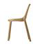

# Multimodal Machine Learning: Disentangling Design Intents 

Work in Progress. Repo for the course 11-777 Multimodal Machine Learning, at Carnegie Mellon University. 

## Abstract
Language is ambiguous; many terms and expressions convey the same idea. This is especially true in design fields, where conceptual ideas are generally described by high-level, qualitative attributes, called design intents. Words such as organic, sequences like the chair is a mixture between Japanese aesthetics and Scandinavian design or complex structures such as we made the furniture layering materials like “a bird weaving its nest” represent design intents. Furthermore, most design intents do not have unique visual representations, and are highly entangled within the design artifact, leading to complex relationships between language and images. Despite advances in machine learning (ML) in vision-and-language representations, state-of-the-art ML models are unable to efficiently disentangle such relationships and consequently, incapable of modeling their joint distribution. Beyond ML research, this work can significantly impact creative practice for designers, architects or engineers. A real-time understanding of design intents could open new design scenarios (e.g. voice-assisted natural language input), that reduce procedures based on intent reinterpretation as imperative commands —move, circle, radius, extrude, vertical— required by digital design engines. ML provides an alternative to such current design frameworks: the means to learn meaningful representations of ambiguous descriptions, like dynamic, light or minimalist. As such, we propose a first-of-its-kind multimodal object-agnostic framework to disentangle, visualize and generate design intents to support a transition from CAD—Computer-Aided Design— to AIAD—Artificial Intelligence-Aided Design.

## Introduction
Language can be ambiguous and similar ideas can be expressed in many different expressions. This is specially true in design fields, where conceptual ideas are generally described by high-level, qualitative attributes, called design intents. Even though these descriptors are highly used in everyday language by designers—"the dinning table should look more organic", "this chair is lightweight and minimal"—, they have complex visual associations due to a partial subjective and conceptual components and thus, finding visual representations is a challenge. While humans might be able to identify design intents from an image of a chair with attributes such as organic or minimalist, and differentiate between a heavyweight and a lightweight stand-lamp, they might also face challenges differentiating design intents such as dynamic, organic or functional. Current machine learning literature is unable to recognize this type of high-level attributes, but has potential to understand them. Resolving such task would have a major impact in design communities, opening new scenarios where natural human language could directly be used in the process of design. 

   
  
  
 Figure 1. Complex relationships between modalities in a sample from ADARI Furniture dataset 

For computational linguistics, resolving this problem can challenge the status of theoretical understanding, problem-solving methods and evaluation techniques [8]. For computer vision, this presents a complex challenge of disentangling qualitative attributes—sleek, elegant, minimal—from images. Beyond its relevance in pushing machine learning research boundaries, this would significantly impact creative practice —designers, architects and engineers. Real-time design intents understanding could open new design scenarios (e.g. voice-assisted natural language input), that reduce procedures based on intent reinterpretation as imperative commands —move, circle, radius, extrude, vertical— required by digital design engines. 

Cross-modal retrieval tasks have been an active area of research during the last decade. Works on joint representations such as \cite{kiros2014unifying} follow an encoder-decoder type architecture to perform retrieval in pair of images and language. Coordinated representations such as \cite{frome2013devise} train independent subspaces for each of the modalities. Generally, literature on cross-modal retrieval use popular datasets such as \cite{flicker8k}, \cite{flicker30k} or \cite{lin2015microsoft}, which focus on well defined objects and structured descriptions where their relationship is relatively easy to identify—a dog is easily recognized by objects detectors—. More recently \cite{gao2020fashionbert} uses transformer architecture \cite{vaswani2017attention} to find text-image pairs on high-level attributes mechanisms using cross-modal retrieval.

Research on identifying high-level attributes has been done in other tasks. For instance, for selecting font types using attributes by \cite{odonovan:2014:font}, or for search tasks on fashion objects with relative attribute feedback by \cite{whittlesearch}. Even this work is very related to our work, they focus on other searching strategies and not necessarily cross-modal retrieval, and their attributes are generally based on single adjectives.

One of our main challenges that has not been addressed is working with unstructured text. Our ADARI dataset does not contain only valid descriptions applied to each image. Rather, it is a report type document from interview between designers and reporters. As seen in Figure \ref{datasample}, each data sample consists of a text document and multiple images that correspond to the same text document. Generally, we have identified three type of relations between sequences in the text and images: valid descriptors that are relevant to images, non-valid descriptors that are opposites to the images, given by negations in sentences, and contextual information about the general philosophy of the designer's practice, which can be either indirectly applied to the images or not applied at all. Note that there exist ground truth labels in each image pair, but these are not indexed.  

In this paper we present an exploratory array of experiments on classification and cross-modal retrieval and classification with the aim of testing whether current state of the art models have potential to disentangle the complex relationships between designs and design intents, which tend to take different shapes, from adjectives, to complex structures like analogies or description by opposites. Our baselines are unable to model the complexity of the dataset. 

Our work uses the Ambiguous Descriptions and Art Images—ADARI—dataset. This dataset is a novel collection of images and descriptions with special emphasis on qualitative attributes present in design intents. The novelty of this project comes, therefore, from the study of such subjective qualitative attributes, and currently, we are testing whether state-of-the-art multimodal approaches on retrieval, captioning or generation work on ADARI. We prove that such current models, objective functions and evaluation metrics are not efficient when dealing with intents, and that we are initiating an exploratory process to determine which task we will focus on for the remainder of the project. For all the following experiments, we work under the assumption than all adjectives in the text are informative, and therefore, we collect a varying size bag of adjectives extracted from the text for each image. We then select top-K adjectives based on importance sampling and term frequency inverse document frequency (tf-idf) formulas. 

The rest of the paper is structured as follows: section \ref{relatedwork} gives a review of prior work that has been done in retrieval with a focus on high-level attributes. We also review related cross-modal retrieval approaches and prior work in ADARI dataset. We describe our multimodal baselines in section \ref{baselines_section} and unimodal baselines in section \ref{unimodal_classifiers}. We proceed explaining how we have set up the dataset for the distinct experiments in section \ref{exp_methods}. We follow by reporting our evaluation metrics and discussing our results in section \ref{discussion}. We finalize by defining our new problem statement in section \ref{problem_statement} and we describe our new research ideas in section \ref{ideas}. \textbf{Note that detailed metrics are tabled on the last page}.

### Related Work
This section first reviews related work in the area of design and high-level attributes, then we mention current trends on cross-modal retrieval and type of datasets these methods use. Lastly, we discuss prior work done using the ADARI dataset. 

### High-level attributes
Research in understanding the relationships between high-level attributes and objects has not received much attention in comparison with work in object-quantitative attributes. Some previous work have focused on image composition, particularly on high-level attributes of beauty, interest and memorability. 

Previous authors described methods to predict aesthetic quality of photographs. \cite{aesthetics} represent concepts such as colorfulness, saturation or rule-of-thirds with designed visual features, and evaluated aesthetic rating predictions on photographs.\cite{li2009aesthetic} used the same approach for impressionist paintings. \cite{dhar2011high} expand the feature space with more high-level descriptive features such as "presence of animals" and "opposing colors", and also attempted to predict Flickr's proprietary "interestingness" measure. Following this type of work, \cite{gygli2013interestingness} predicted human evaluation of image interestingness, building on work by \cite{isola2011makes}, who uses various high-level features to predict human judgements of image memorability. Similarly, \cite{borth2013large} performed sentiment analysis on images using object classifiers trained on adjective-noun pairs. Building on all these works, \cite{karayev2013recognizing} present two novel datasets: 80K Flickr photographs annotated with 20 curated style labels, and 85K paintings annotated with 25 style/genre labels, and provide a baseline for style prediction, with examples of such styles being "Impressionism", "Abstract Expressionism", "Romantic" or "Minimal". 

Continuing on style type problems, more recently \cite{gatys2016image} present a system that creates artistic images based on style and content images. A seminal paper was published by \cite{isola2017image} where conditional adversarial networks \cite{mirza2014conditional} are used for image-to-image translation tasks. 

Research that focus on attributes rather than style have also been explored. \cite{odonovan:2014:font} explore new ways to make interfaces for font selection more natural, organizing fonts based on high-level descriptive attributes such as "dramatic", "legible" or "friendly". Most recently \cite{wang2020attribute2font} proposed a novel model called Attribute2Font to automatically synthesizing visually pleasing glyph images according to user-specified attributes and their corresponding values. The claim to be the first model in the literature capable of generating glyph images instead of retrieving existing fonts. Their model performs font style transfer between any two fonts conditioned on their attribute value.

Object attributes have been explored for image search using binary attributes in works by \cite{kumar2011describable, tao2009skyfinder}. Other work for searching interfaces has been done by \cite{parikh2011relative}, estimating relative attributes. Whittlesearch \cite{whittlesearch} allows searching image collections using also relative attributes. In the following year \cite{kovashka2013attribute} improved their technique by using an adaptive model. Two people may have slightly different internal models for what makes a shoe look "formal", or they may disagree on which of the two scenes looks "more cluttered". Rather than discount these differences as noise, they propose to learn user-specific attribute models by adapting a generic model trained with annotations from multiple users. 

#### Cross-modal Retrieval
We briefly review some important work done in cross-modal retrieval, including coordinated and joint representation models that we have implemented. 

The main objective of joint representation models is to map images and text descriptions to a joint space for retrieval operations in captioning tasks. One of the problems on visual recognition systems based on N-way discrete classifiers is that all labels are disconnected and unrelated, resulting in visual recognition systems that cannot transfer semantic information about learned labels to unseen words or phrases.

The following three related papers provided state-of-the-art results on image and sentence retrieval at the  time of publishing, using joint or coordinated representations at the time of publishing: \textit{Unifying Visual-Semantic Embeddings with Multimodal Neural Language Models} by \cite{kiros2014unifying}, \textit{DeViSE: A Deep Visual-Semantic Embedding Model} by \cite{frome2013devise}, and \textit{Multimodal Convolutional Neural Networks for Matching Image and Sentence} by \cite{ma2015multimodal}. This last work is futher explained in the \ref{baselines_section}. They base their learning using different types of contrastive loss. 

DeViSE and Unifying Visual-Semantic Embeddings are seminal work in coordinated and joint representations, respectively. Both approaches use the same loss function as follows: loss(img,lb) = max [0, m - t_{lb}Mv_{img} + t_{contr.}Mv_{img}) ] To calculate the matching score between images and corresponding descriptions, they use the last layer's weights of a pre-trained CNN, such as VGG and others. DeViSE tests their results on ImageNet (ILSVRC) 2012 1K dataset while that Kiros et al. use Flickr8K \cite{flicker8k} and Flickr30K \cite{flicker30k}. The main different between the two is that DeViSE uses pre-trained Glove vectors directly, and for sentences they average the word emeddings while Kiros et al. use an LSTM to get the representation of the sentence. 

Most recently, \cite{gao2020fashionbert} uses state-of-the-art multimodal transfomers to perform cross-modal retrieval on attribute-level region of interests for text and image matching. 

#### Prior Work on the ADARI dataset
Preliminary explorations that visually disambiguate vague terms in the context of design have been done by \cite{Ladrondeguevara2020multimodal}. The authors use a multimodal approach that combines a pretrained convolutional neural network, ResNet-152 \cite{resnet}, to get the representation for images with general word indexes into a common joint subspace. A bidirectional Long Short-Term Memory (biLSTM) decoder—which models the labels co-occurrence information—learns semantic relationships between words and images. Early results are positive and encouraging for several reasons: the baseline presented is able to detect design nuances in the images that relate to ambiguous words such as “curvaceous”, “wobbly”, “linear”, or “slouchy”, where none of the corresponding images necessarily had those labels applied in the ground truth (see Figure \ref{pred}). This is an indication of a potential approach for understanding ambiguous terms through associations of words-images. 

   
  
  
Figure 2. Visual language semantic relations. 

To our knowledge, our work is the first attempt to scale work on high-level attributes on very complex unsupervised scenarios, where images do not have ground truth associating descriptors. Furthermore, our language modality does not come from third party workers annotating the data, but the very own natural description from professional designers, which is the most important aspect. Since the goal of this project is to be able to integrate this knowledge and comprehend designs more naturally, we need the language to be as consequent and honest with the design as possible, rather than just a third person's opinion on the work. 

### Multimodal Baseline Models

#### Two Way Nets
ADARI raises a key question about design: How can we unify the intent of the designer with the design itself? Such question immediately leads to coordinated representation learning. This task aims to embed images and the corresponding text in the same subspace. Published in 2017 by \cite{eisenschtat2017linking}, the Two Way Net architecture uses two tied autoencoders to first encode each view into an embedding, and then transform each view into the opposite one. The authors introduced some novelties, including regularizing the batch normalization layers and tying the masks of dropout layers between paired autoencoders. 

The loss is given by three terms: $L_x = ||x - \hat{x}||$, $L_y = ||y - \hat{y}||$, and $L_h = ||H^j(x) - H^j(y)||$, where $x$ and $y$ are the two input modes, and $j$ is the extracted hidden layer used as the coordinated representation. 

#### Multimodal Convolutional Neural Network for Joint and Coordinated Representation—mCNN
\cite{ma2015multimodal} propose a model based on three convolutional networks coupled end-to-end: one for learning image representations, called image-CNN, one to produce the joint representation of an encoded image representation and word representations, called matching-CNN, and an MLP that takes the joint representation and outputs the matching score between image and words, see Figure \ref{matchingcnn}. The image CNN is a pre-trained CNN network (the authors use VGG with 19 weight layers \cite{vgg}, and the OverFeat network). The core network is the matching CNN, and the authors design different networks that work at different language-level matching relations, such as word-level, phrase-level or sentence-level. Their loss function is defined as eq. \ref{eq1}, where \(s_{match}\) is the output of a the MLP (using a relu nonlinearity function). They test their models on Flickr8K \cite{flicker8k}, Flickr30K \cite{flicker30k} and Microsoft COCO datasets \cite{lin2015microsoft}. For evaluation, they report the median rank, and the R@K (with K=1,5,10), which computes the fraction of times the correct result was found among the top K items. 

<em>(2)</em>

Based on this, our implementation of m-CNN differs mainly in some points. Firstly, to get the feature representation of images, we use a pre-trained ResNet-152 \cite{resnet} instead of the original VGG-19 that authors use. Secondly, for our objective function, we use triplet margin loss, defined as follows:

<em>(3)</em>
where <em>(3)</em>

In the triplet margin loss function, the triplet is composed by an anchor, a positive example and negative examples, \(a, p \text{ and } n\) in eq. \ref{eq3}, respectively. We optimize using a margin of \(0.5\). We found that triplet ranking loss function yielded better results and had a smoother convergence than the author's original loss function. 

Our model also respects the three main parts of m-CNN model: a pre-trained CNN network for image embeddings, a word embeddings matrix for the vocabulary of our dataset and a matching CNN network that convolves image representations and word representations altogether. For word embeddings, we firstly fine-tune off-the-shelf Glove embeddings \cite{pennington2014glove} on our ADARI dataset, setting their dimension to 50. We use the word embeddings dimension for our joint representation space. To ensure this, we set the last fully connected layer of the pre-trained ResNet to a 50-dimensional output, having the last matrix \(W\) of weights of shape \((2048, 50)\). We let the model backpropagate throughout both the ResNet model and the word embeddings' network. 

Each image in the dataset is associated with a set of adjectives that we assume correspond to design intents. The length of the list of design intents varies, and for this experiment we select five adjectives at random. The matching-CNN takes an image and five descriptors and perform the following operations: we define a receptive field \(K_d\) that defines the number of words that are concatenated into a long vector jointly with the image representation. We chose \(K_d\) as 3 for this experiment. The vector \(V_i\) is denoted as: \(V_i = v^i_{wd} || v^{i+1}_{wd} || ... || v^{i+k_{rp}-1}_{wd} ||v_{im}\), where \(v^i_{wd}\) is the vector representation of word \(i\), \(v_{im}\) is the vector representation of the image \(i\) and \(||\) denotes concatenation. 

This vector \(V_i\) is the input to a multimodal convolution in the matching-CNN network, which lets the image meet the word-level fragments to promote interaction between image and words. Specifically, the matching-CNN network has three convolutions: the first convolution has an input channel 1 and output channel 200, the second and third layers have output channel 300. The three layers have kernel size 12, stride 2 and zero padding, and are followed by a max pooling layer of kernel size 2 and stride 2. The output is reshaped to be \((batch, 3000)\). See figure \ref{matchingcnn}. 

To get the scores of each pair of image and design intent descriptors, we follow the original model and use a Multi-Layer Perceptron (MLP) network. The MLP consists of two fully connected layers, that map the output of the matching-CNN to a float number. The hidden layer of the MLP is followed by a ReLU activation function. The triplet loss function takes in three scores: two for correct image-description pairings, and one for an incorrectly matched description. 

   
  
  
Figure 3. The m-CNN architecture for matching image and sentence. Image representation is generated by the image CNN. Matching CNN composes words to different fragments of the sentence and learns the joint representation of image and sentence fragments. MLP summarizes the joint representation and outputs the matching score. 

Note that we do not perform retrieval in a joint representation, but in a coordinated one. The joint representation is used to get the scores between image and positive and negative associations. 

#### ResNet + Glove Contrastive Learning —ResVe

We present a third baseline mainly to compare a more straight forward approach with the previous slightly more intricate m-CNN approach. This baseline takes a pretrained ResNet-152 for image representation, removing the last classification layer and adding a fully connected layer of 50 neurons. The text modality consists of an MLP with an embedding layer and a fully connected layer. The embedding layer is initialized with the weights of our previously finetuned Glove vectors on the ADARI dataset. We call this model ResVe. The objective function of this approach is the same as the m-CNN baseline, triplet margin loss, as defined in eq. \ref{eq3}. 

#### Multimodal BERT+ResNet Multilabel Classifier
We present a baseline for multimodal multilabel classification using late fusion. First we use a ResNet-152 model to train a multilabel image classifier. We also use a pretrained BERT \cite{devlin2018bert} for sequence classification. For a given image-text pair $(i, t)\in \mathcal{D}$, we concatenate the last features of the ResNet-152 model $M_{res}(i)_{-1}$ with the BERT embedding of the description $M_{BERT}(t)$. We then trained a linear layer to classify three labels from these embeddings. The object here was binary cross entropy. 

### Unimodal Classifiers
This section describes three baseline classifiers for which we provide evaluation metrics and clustering plots that help explain the distribution of our ADARI dataset. For image classification, we use ResNet-152 and VGG-16 architectures and train on Furniture-ADARI dataset and compare an ImageNet pretrained model versus using random weights initialization. For text classification, we finetune a pre-trained BERT model on sentence classification. We demonstrate the high variance that ADARI presents, and we discuss some potential directions after such unimodal and multimodal experiments. Both architectures are run with the same settings and hyperparameters.   

For each image \textit{I}, we follow 2 strategies for label extraction, top-10 and top-3. The 10 most common adjectives are sampled following the sampling rate from \cite{mikolov2013distributed} from the varying list of associated descriptor. This results on a vocabulary size of \(2,486\) adjectives, encoded into a multihot vector. For the top-3 labels, we use term frequency inverse document frequency (tf-idf) algorithm that balances common and uncommon words from the corpus. This method expands the vocabulary size to  \(4,780\) words. Each image \textit{I}, then is paired with a \(d-dimensional\) vector with \(top-K\) entries set as 1 and the rest as zeros. Finally, we use Binary Cross Entropy with Logits as objective function.

### Experimental Methodology
We evaluate all our models on the ADARI dataset first presented in \cite{Ladrondeguevara2020multimodal}. This section first describes the dataset. We then explain the experimental methodology for evaluating each of the experiments, namely, 2-way net, m-CNN, ResVe, ResNet152 multilabel classifier,  VGG16 multilabel classifier, BERT classifier and Late Fusion ResNet+BERT multimodal multilabel classifier.

To address the issue of disentangling design intents in the context of creative practice, we use the Ambiguous Descriptions and Art Images—ADARI—dataset. The self-annotated ADARI dataset contains a total of 33,230 samples of contemporary creative works represented by 264,028 raw sentences—provided by the original creators and by art curators—that describe 241,982 images. This dataset was assembled by collecting articles that include editorial descriptions along with associated images of the creative visual work. ADARI is an organized dataset divided into seven categories: \textit{architecture, art, design, product design, furniture, fashion} and \textit{technology}. ADARI is the first dataset of pairs of images and language that, besides containing objective information of the elements in the images such as \textit{wooden chair} or \textit{black table}, focuses on high-level attributes that correspond to design intents, such as \textit{minimal, elegant and sleek looking chair}. ADARI also contains contextual information that can or cannnot be indirectly applied to the images, and other more complex structures mentioned in \ref{Intro}, such as analogies. Note that there are ground truth labels in each image pair, but it is not indexed. 

We work with the Furniture domain within the ADARI dataset, and we use word modality for all our experiments. The Furniture-ADARI dataset contains \(17,532\) images of contemporary workpieces. We use  those words in the dataset that have an ADJ Part-of-Speech (POS) tag, in a total of \(7,491\) adjectives. We crop the words that appear less than 3 times in the dataset, yielding a vocabulary size of \(2,486\) adjectives. Each image is associated with a varying number of adjectives, with a maximum of 10 per image. ADARI is an unbalanced dataset, and we address this problem individually for each of the experiments. 

### Models and Methods
#### 2-Way Nets
The Two Way Net architecture requires the inputs to be pre-encoded by some unimodal method, ideally one that extracts relevant features for the multimodal case. To evaluate this model, we employed the ResNet \cite{resnet} embeddings of the images. For the adjectives used to describe each design, we use GloVe embeddings \cite{pennington2014glove} of each word and concatenated them together (as was done in the original Two Way Net paper). We used 3 hidden layers per autoencoder, of sizes 2000, 3000, 16000, with the second layer output used as the hidden embedding (as was done with the Flickr30k \cite{flicker30k} experiments). The model was trained from scratch with ADARI, using similar hyperparameter settings to those used for the Flickr30k experiments done by the original authors. The model's loss did converge after 100 epochs, as recommended by the authors of the original paper.

#### m-CNN and ResVe Triplet Loss
We split the dataset into train, test and validation. The training set, test set and validation set contain \(16,180\), \(852\) and \(500\) images, respectively. We select 10 adjectives at random as anchors from the list of adjectives descriptors in each image, another 10 adjectives at random as positive samples and a random set of 10 adjectives that do not belong to such corresponding descriptors from the vocabulary. We choose batch size of 64, train for 10 epochs and optimize via stochastic gradient descent (SGD) with a learning rate of 0.001 and a momentum of 0.9. At inference time, only the image CNN is used to get the image representation. Given an image, we extract its feature representation and calculate the closest 20 neighbors in the word embedding space.  

#### ResNet152, VGG Multilabel and BERT Classifiers
The classifiers give a basic perspective on how well the data can cluster. Each image \(I\) is associated with a \(2,486-dim\) multihot vector with up to the most common 10 adjectives in the vocabulary. For Resnet152, we split the dataset into  \(13,225\), \(3307\) and \(1000\) samples for training, testing and evaluation, respectively. For prediction, we use a sigmoid function on top of the last layer of the last fully connected layer, and report evaluation metrics using different thresholds on the sigmoid function. 

#### Multimodal BERT+ResNet Multilabel Classifier
Our multimodal baseline presented in \ref{multimodalBERT} is a late fusion multilabel classifer which concatenated the features of a pretrained BERT and Resnet model to produce a joint representation for classification. The experimental setup was the same as the unimodal classification models. 

#### Evaluation Metrics
Following the comprehensive study of evaluation metrics for multi-label classification presented in \cite{wu2017unified}, we employ weighted/unweighted precision, weighted/unweighted F1-measure, weighted/unweighted accuracy, mean average precision (mAP)\footnote{mAP and Label Ranking Average Precision score (LRAPs) yield the same results} and area under the receiver operating characteristic curve (roc auc) for performance comparison. For such metrics, we perform a threshold study on the label confidence using a threshold sigmoid function and report \(T > 0.1, 0.3, 0.5, 0.7, 0.9\). All metrics are averaged with respect to their samples, that is, we calculate metrics for each instance and find their average. To combat the issue of having an unbalanced dataset, we compute the weight of each sample by class and report a comparison of such metrics both weighted and unweighted. Mean average precision (mAP) is the mean value of per-class average precisions. The above metrics do not require a fixed number of labels for each image. 

For our multimodal cross-retrieval baselines, we report evaluation on Recall\@K (R@K), where \(K \epsilon \{1,5,10\}\) and mean average precision (mAP). The R@K metric considers \(N\) labels as ground truth —\(N\) does not have to be fixed—, and report the number of correctly predicted labels in the top-K queries. 

### Results and Discussion
We present the results and discussions on the unimodal and multimodal baselines. Generally, all our experiments have a tendency to cluster the images based on object-level attributes such as colors, background or materials (see Figure \ref{tsne_class}). However, the models are unable to cluster the data based on design intents, which is the goal of this project. 

#### 2-Way Nets
As a baseline, we aimed to simply see if Two Way Nets with ResNet and GloVe embeddings were capable of clustering around design intent across modalities. As a simple qualitative test, we used t-SNE \cite{tsne} to reduce the hidden embeddings of the test set to two dimensions, and plotted the result. We ran t-SNE for all perplexities between 5 and 50, achieving best performance at perplexity 36. 

   
  
  
 Figure 4. Two Way Net-generated embeddings reduced to dimension 2. Green samples are embeddings of images, blue are embeddings of text. 

This clustering suggests the Two Way Nets were able to encode similarities in the unimodal representations, however. A closer inspection of these clusters using simple nearest neighbours shows some relationships like the figures 3 and 4. These chairs share design elements, including both their material and simplicity.

   
  
     

  
 Figure 5. Image Nearest Neighbor 

For a quantitative measure of the clustering of our hidden coordinated representations, we performed numerous clustering techniques, including kmeans, affinity propagation, agglomerative clustering, OPTICS, and Birch. However, each method produced only two clusters, each containing one of the modalities. It is thus evident that vanilla Two Way Nets using our configurations are not capable of capturing understanding of design intents. While our analysis is not exhaustive, this result is to be expected given the complexities of design intents. It is highly unlikely out of the box image embedding techniques will not capture features relevant for analysing design intents, as these models are often trained for object detection tasks. This shows the gap between tasks that ADARI presents and classic image captioning/object detection techniques. 

#### m-CNN and ResVe Cross-modal Retrieval
We perform the following retrieval tasks: A) image retrieval given a query image \(I\). For each query \(I\) image in the test set, extract the image representation and find the closest \(N\) images to \(I\). We define \(N\) to 5. For each image in \(N\) we extract their ground truth labels and report Recall\@K (R@K), with \(K = 1, 5, 10\), and mean average precision (mAP). B) Word retrieval given a query image \(I\). Since the image space and word space are both 50-dimensional, we get the nearest 20 words to this image. Then we report whether those words are contained in the set of ground truth labels of the image. C) Image retrieval given a design intent; in this case the design intents are adjectives. For instance, given the word \textit{organic}, find its closest 10 images and report whether the ground truth labels of these images are \textit{organic}. See table 1. We also report random prediction for word and image retrieval, and include the metrics of off-the-shelf pretrained resnet in the image retrieval task. 

We find that the best performance in image retrieval is given by our m-CNN model. This is expected since it is also a more complex model in which text and image are convolved together, and the score is based on such convolution. Our ResVe model is still better than image features from ResNet, although not by much. This shows that the high variance of the images and the large vocabulary size requires more complex models than just applying contrasting loss to pretrained models. 

The performance of our baselines on word retrieval is extremely low. Our models do not get enough signal when doing retrieval operations in the language modality, and just random retrieval outperforms our models. A reason for this might be that the images in the joint convolution in the m-CNN model out-weight the text modality. No clear outcome is drawn by the under-performing ResVe other than the model does not get sufficient signal. 

   
  
     
       

  
 Figure 6.Image retrieval on image modality. Colored frame indicates the query image I. Images to the right are the closest 5 images to I and corresponding labels that are present in the list of labels of I. 

Figure 6 shows a comparison of the two baselines, m-CNN and ResVe, and off-the-shelf pretrained ResNet. The image at the left containing the frame is a query image from the test set, and the 5 remaining images are the closest images in each model's image space. Highlighted words under the query image are matching labels the query's closest neighbors.

Figure 6a shows a more consistent aesthetics between the 6 images. This model is also the best performing model counting the amount of labels that the closest images have that are matching with the image query. Figure 6b also show some visual consistency, but it fails in retrieve a wooden chair in the 2nd closest image. The number of matching labels is the lowest between the three models. Finally off-the-shelf ResNet (Figure 6c) shows more variance within the images. However, the number of matching labels is closer to m-CNN than ResVe. A conclusion of this might be that the images still have a very high number of annotations, and that not all adjectives are valid descriptors of the image. Finding synsets to reduce the vocabulary size might help decrease the variance. 

   
  
  
  

#### Multilabel Classifiers
ADARI's labels correspond to adjectives extracted from the corpus that might describe each set of images, with an average of 26 labels per image. We decrease the amount of labels following two strategies. The first calculates the sampling rate equation by \cite{mikolov2013distributed} in their skipgram model, and we select the 10 labels with higher sampling rate. The second selects the top 3 labels using the term frequency-inverse document frequency (TF-IDF) formula:

<em>(2)</em>

where \(tf_{i,j}\) is the number of occurrences of \(i\) in \(j\), \(df_i\) is the number of documents containing \(i\), and \(N\) is the total number of documents. The performance of our ResNet-152 and VGG-16 multilabel classifiers are illustrated in table 2. We observe that the metrics on the top 3 labels present a worse F1 score and precision but better accuracy, and similar mean average precision and area under the curve metrics. This is expected since the TF-IDF tends to balance low-occurrence labels, so that labels that repeat across the dataset such as \textit{different} have a lower score because it does not provide meaningful information to particular documents. Therefore, the vocabulary increases significantly, from \(2,486\) in top-10 labels to \(4,780\) words. For multilabel classification problems, however, mean average precision (mAP) or label ranking average precision score (LRAPs) are more meaningful metrics. Still, our ResNet model performs very poorly with nearly a 9\% average precision when calculated weighted samples on top 3 labels. While this is better than random, it is far away from good. The VGG-16 model reports worse numbers than ResNet. To better understand how the model cluster the images, we run a T-SNE visualization on images on the test set as shown in Figure \ref{tsne_class}. We see how the images are clustered based on color, materials and background, rather than based on design intents. The visualization of the T-SNE on labels show the inability of our model to cluster images based on design intents (Figure \ref{tsne_class}). Approximately around epoch 25, both top-10 and top-3 datasets' versions overfit the training data, achieving an F1, accuracy, precision and AUC of 99\% (in the training set), which is an indication that the model is powerful enough for this dataset.

   
  
  
 Figure 7. Clusters of images on fine-tuned ResNet-152 

   
  
  
  

Table 3 shows the same evaluation metrics on our unimodal BERT classifier and multimodal BERT + ResNet classifier. The performance of both models is much higher than the image classification tasks. BERT is able to utilize it's layer of self attention to focus down on the adjective that is the most prominent in the description. Given that the adjective is already in the input, the strong performance by BERT is clearly implemented.The multimodal BERT+ResNet classifier improves the mean average precision by 1~1.5 points, proving that the underperforming ResNet does not contribute much to the classification process. 

   
  
  
  

### New Research Ideas
Moving forward, we plan on adapting and modifying a recently published paper, FashionBERT. \cite{gao2020fashionbert} published in May 2020, it addresses many of the same issues we have discussed. One prominent contribution is that of patched image tokens. Traditional cross modal methods use regions of interest to align text to image features. This is problematic in the more subjective domain of fashion and design, as regions of interest typically cluster around objects like faces, hands, etc that are irrelevant in terms of the design. To address this, FashionBERT divides the image into a grid of patches, where each patch is encoded and used as a token. 

   
  
  
 Figure 8. FashionBERT model architecture 

#### Patches with Regions of Interest
One direction we'd like to experiment with is combining regions of interest with patches. Our images contain more complex backgrounds than those in Fashion-GEN. It may be useful to have the model first extract the area containing the object in question, and then divide that region into patches to avoid focusing on object-level details. Our multimodal experiments with m-CNNs showed good clustering performance. Thus, we could the features of this style of model as our backbone when encoding the patches, and as a method for producing loose regions of interest to narrow down our patch region. 

#### Adjective Weighted Masked Language Modelling
A common training task for BERT models is Masked Language Modeling, in which we mask each word in the sequence with some probability and have the model maximize the log-likelihood of predicting that word. In most image captioning datasets (including Fashion-GEN), captions are entirely relevant to the image at hand, and thus most masked words are likely relevant to the image. ADARI contains longer descriptions with some irrelevant tangents from the designer. Thus, we hypothesize we could get a better training signal from masking specific parts of speech, namely adjectives, with higher probability. Ideally this should force the model to more often refer to the image to infer a masked word, since adjectives are more likely to be correlated with the design intent. More formally, given a sequence of tokens $\{t_1, \dots, t_n\}$, we would isolate the indices of adjectives into a set $\{i_1, \dots, i_k\}$. We would mask each $t_{j}$ where $j\in \{i_1, \dots, i_k\}$ with probability $.2$ and each $t_{j}$ where $j\not \in \{i_1, \dots, i_k\}$ with probability $.1$. 

#### Sentence-Level Embeddings
The noisiness of our descriptions is a unique aspect of ADARI. We face, in some sense, a similar problem that motivates regions of interests or patches when extracting image features. It may be useful to apply  patching to the descriptions, specifically around sentences. In these design discussions, each individual sentence is usually entirely relevant to the design, or not at all. Under this hypothesis, chunking the descriptions into their sentences and producing embeddings on a sentence-level basis (using self-attention) may help the model avoid over-focusing on irrelevant parts of the descriptions. 

In addition to using the typical image-description alignment training task in which the model must classify whether an image and description are related, we could pair these sentence level embeddings with their images and irrelevant images, minimizing the binary cross-entropy loss:

$$-\frac{1}{n}\sum_{i=1}^n y \log(P(\hat{y})) + (1 - y)\log(1 - P(\hat{y}))$$

Where $y = \begin{cases} 1 & \text{if the sentence embedding is paired } \\& \text{with the image} \\ 0 & \text{otherwise}\end{cases}$. The unimodal classification experiment which used a BERT sequence classifer proved rather successful. Thus, we could use a pretrained BERT model over each sentence to produce our sequence of sentence-level embeddings in additon to the FashionBERT-style word level embeddings. This more fine-grained alignment task was suggested in the conclusion of the FashionBERT paper, although they suggested aligning at a word embedding or image patch embedding level. Due to the aforementioned noise in the descriptions, it is probably not appropriate to do such a word embedding level alignment task. 

## Unimodal Explorations
### Finetune Glove Vectors
To evaluate unimodal representations of in-domain (design) language, we compared three results: training embeddings from scratch, with random initialization of weights, using pre-trained Glove vectors, and fine-tuning Glove vectors following a skipgram model. For that, we initiate the weights of the skipgram model with the glove vectors, and run the model for 20 epochs on ADARI. We found that fine-tuning Glove embeddings yielded better results.  

The vocabulary focuses on 3400 adjectives extracted from both sources, creators and curators in ADARI, capturing both qualitative and quantitative adjectives, plus the existing vocabulary in Glove. If a particular word from ADARI does not exist on the Glove vocabulary, we initiate the weights with a normal distribution with scale of 0.6. We frame the context of the words with a window-size of five on each side of the word, and we tested 50, 100, 200 and 300 dimensional embeddings. The 50 dimensional embeddings yielded better results, evaluated through manual inspection by design experts, see table 1.

   
  

### DCGAN on ADARI
We ran a DCGAN model on ADARI, using the same parameters as the original paper, to evaluate whether the ADARI dataset provides the means for deep learning models to learn the image distribution. We do not have evaluation metrics yet of this experiment, although the results generated by the network are positive, see Figure \ref{gan}. The fact that ADARI seems consistent across its subdomains, like furniture, is an indicative that we could further use some type of conditional GANs to generate visualizations of design intents. It is important to clarify that we are not looking to generate new design outputs within a subdomain, like a chair, or a table. Rather, we would be interested in creating a model that is able to learn the distributions responsible for shaping design intents, that is, would it be possible to generate images that directly forge the visual attributes corresponding to intents such as dynamic, smooth or minimalist?

   
  
  
Figure 7. Results of DCGAN trained on ADARI. The first six columns are real images. 

